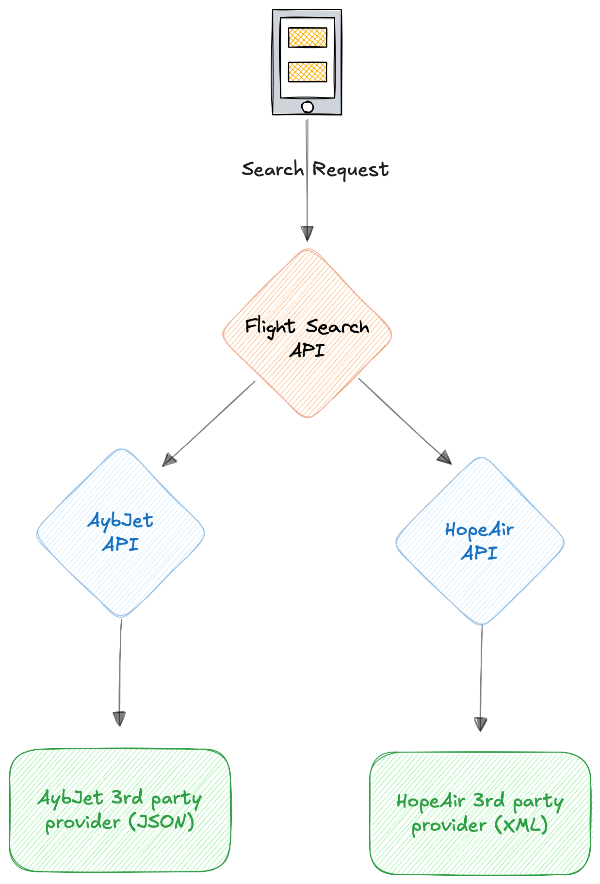

# ✈️ Flight Search API - Code Case Documentation

## 📄 Introduction
This code case is designed to evaluate a candidate's understanding of a microservice architecture, asynchronous communication, and data aggregation. The task requires the implementation of a **Flight Search API** that queries multiple mock providers to aggregate flight data and present the results in a unified response format. Each mock provider fetches data from different third-party providers with varying data formats and protocols.

## 📋 Requirements

1. **Microservice Structure**:
   - The project should consist 3 microservices:
     - **Flight Search API**: Acts as the main search service, querying other mock provider APIs and aggregating the results.
     - **Provider Services**: Mock APIs representing flight providers such as HopeAir and AybJet. These mock providers connect to third-party providers to fetch flight data.

2. **Request Flow**:
   - The Flight Search API initiates the request flow by sending queries to provider services (HopeAir and AybJet) via their **Search** endpoints.
   - The provider services then communicate with their third-party data sources to retrieve flight information.

   

3. **Inter-Service Communication**:
   - The Flight Search API sends HTTP-based requests to HopeAir and AybJet's Search endpoints.
   - **Variable Response Times**: Each provider service may have a different response time. The Flight Search API should handle these variations by using asynchronous requests, allowing it to aggregate and return results from providers that respond in time, even if some providers are delayed.
   - Providers respond with flight data, which the Flight Search API aggregates and returns.

4. **Third-Party Provider Data Sources**:
   - Each provider interacts with third-party data sources with different data formats:
     - **HopeAir**: Fetches data from a SOAP API, receiving responses in XML format.
     - **AybJet**: Fetches data from a REST API, receiving responses in JSON format.
   - These third-party responses must be processed and converted to a common structure by each mock provider.

5. **Data Structure**:
   - The aggregated response is sorted by price and returned to the user.

6. **Mock Data**:
   - Providers should return static mock data for demonstration.

7. **Error Handling**:
   - If any provider is unavailable or responds too slowly, skip that provider and continue with available data.

## 🔄 Flight Search API - Request Example

The Flight Search API sends a standardized request format to HopeAir and AybJet's Search endpoints.

## 🌐 Third-Party Provider API Request and Response Examples

### 1. HopeAir Third-Party SOAP API

- **Request**: SOAP-based XML request format
- **Response**: XML response with flight data

### 2. AybJet Third-Party REST API

- **Request**: JSON-based REST API request format
- **Response**: JSON response with flight data

## 🔀 Provider API Responses (Internal Structure)

Each mock provider processes the third-party data and returns it in a standardized format to the Flight Search API.

## 📝 Aggregated Response Example

The Flight Search API aggregates the results and returns them to the user in a format sorted by price.

## 🚀 Nice-to-Have
- Generic HttpClient in Flight Search API
- If you would like to implement booking, you can do it.
- When providers return a large volume of flight data, how would you implement **asynchronous data streaming** to provide a faster user experience?