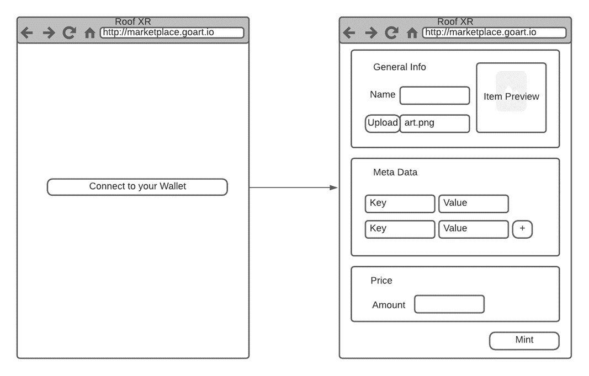

# NFT Minter DApp

## Table of Contents
- [Summary](#summary)
- [Details](#details)
- [Solution](#solution)

## Summary
Imagine that you have an NFT minter app which is basically for use to mint an NFT. But that does not need to be fully designed. Just NFT minting/creating page is enough for our journey.

***

## Details
- You should create a web app with a basic backend to communicate blockchain system with our UI.
- There would be two pages, welcome page as connect to wallet & minter page.
- We need a basic NFT minter page that contains a general info section, meta-data section, and price input section as below sample mockup.

- Name and NFT file itself are required. Metadata is not required. But if you would like to use meta-data, should be persisted on off-chain solutions as DB or file systems.
- You could persist the NFT binary on IPFS, DB, or any cloud storage service. But couldn’t be on-chain. You can use URL in off-chain.
- ERC 721 token standard is mandatory.
- Solidity is mandatory for developing requested smart contracts to mint an NFT on blockchain.
- You could use any public blockchain to develop your blockchain side as ETH, AVAX, etc.
- You can use any stack to build your web app and server-side as react, NodeJS, etc.
- There should be 2 wallets on your blockchain side to build some basic tokenomics. Liquidity wallet and treasury wallet. We have a royalty fee on the backside. It should be %10 off your price. When the user mint the NFT, 6% of 10% will be transferred to the treasury wallet, 4% to the liquidity wallet.
- You could prepare one click install script file as bash or shell.
- Imagine that the liquidity wallet/pool is our staking reward resource. If we want to calculate a daily annual percentage rate (a.k.a. APR) here and show it to users in a way that will not make loss our money, what kind of algorithm is set up? Please explain it in your own words or charts.

***

## Solution
Design a system that contains all rules in the details and please make a readme file to explain your solution. You could also draw diagrams and flow charts. You could use any software language, platform, tool, library, or framework. Please push your solution to GitHub and share the related URL with us.