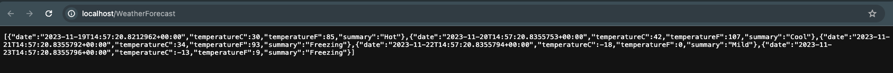

# Kubernetes Mini-Cluster for .NET Core App Deployment

This repository provides the configurations and scripts to deploy a .NET Core application on a local Kubernetes cluster using Kind. The system includes an NGINX Ingress Controller to handle external HTTP requests.

- Ingress: Handles HTTP requests from outside the cluster.
- Service: Provides load balancing across the pods.
- Deployment: Deploys two pods hosting the app instances from DockerHub. (since there is no specification about the namespace, pods were deployed to the default namespace.)

## Prerequisites
Before you begin, make sure you have the following tools installed:

- [Docker](https://www.docker.com/get-started)
- [Kubectl](https://kubernetes.io/docs/tasks/tools/install-kubectl/)
- [Helm](https://helm.sh/docs/intro/install/)
- [Kind](https://kind.sigs.k8s.io/docs/user/quick-start/)

Ensure that the `deploy.sh` script has executable permissions:

```bash
cd sample-app
chmod +x deploy.sh
```

### Setting up the Kubernetes Cluster

```bash
./deploy.sh
```

This script will:

- Create a Kind cluster named "goart."
- Install NGINX Ingress Controller.
- Deploy the .NET Core application using Helm.

### 5. Testing the Application
Once deployed, test the application by sending an HTTP GET request to the specified URL pattern:

   - http://localhost/WeatherForecast

You should see this result on your browser.



### Kubernetes Environment Guide

```mermaid
graph LR;
 client([client])-. Ingress-managed <br> load balancer .->ingress[Ingress];
 ingress-->|/WeatherForecast|service[Service];
 subgraph goart kind cluster
 ingress;
 service-->pod1[dotnet-app-deployment-pod];
 service-->pod2[dotnet-app-deployment-pod];
 end
 classDef plain fill:#ddd,stroke:#fff,stroke-width:4px,color:#000;
 classDef k8s fill:#326ce5,stroke:#fff,stroke-width:4px,color:#fff;
 classDef cluster fill:#fff,stroke:#bbb,stroke-width:2px,color:#326ce5;
 class ingress,service,pod1,pod2 k8s;
 class client plain;
 class cluster cluster;
 ```


### Troubleshooting

If you encounter issues during deployment, consider the following:

- Ensure Docker, Kubectl, and Helm are installed.
- Check the executable permission of the `deploy.sh` script.
- Verify the Ingress Controller is ready before accessing the application.
- Inspect pod logs for detailed error messages:
