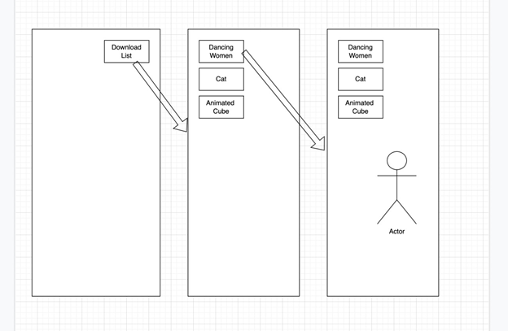

# Content Visualizer

## Table of Contents
- [Summary](#summary)
- [Details](#details)
- [Solution](#solution)

## Summary
Imagine you have 1 main Unity Project. Your app supports showing 3D prefabs, assets that were created in
other Unity projects. Your app is like Youtube but for 3d assets.

## Details 
- Create an app that supports the ability to download and show assets that other users created.
- You should create the main app that supports showing content that is not built-in in your main project. You
could think it like publishing your app with mostly scripts. When users download your app, they will
download your 3D assets from URLs. 
- Create a main app that can download assets from URL and Instantiate (Use Built-in Unity feature,
AssetBundles).
- Keep in mind, Unity’s built-in AssetBundles are platform-specific. You can choose iOS, Android.
- Create a second project and build 3-5 animated characters with asset bundles.
- Upload your built assets to any public cloud storage. You should download these assets and
instantiate them in front of the user on your main app.
- Create a JSON file that has information about your assets. Upload this file to any cloud server. Example :

```json
[
    {
        "assetName" : "dancing women",
        "downloadUrl" : "https://assetdownload.com/dancing-women"
    },
    {
        "assetName" : "cat",
        "downloadUrl" : "https://assetdownload.com/cat"
    },
    {
        "assetName" : "animated cube",
        "downloadUrl" : "https://assetdownload.com/animated-cube"
    }
]
```
- Create a static button top right of UI that downloads this file with UnityWebRequest and deserialize
text to your list class. Instantiate buttons as many as your JSON file has on UI. Add on click actions to
buttons. Example: You have created 3 buttons after you download the JSON file. When the user clicked “cat”
button, should download "https://assetdownload.com/cat" and instantiates cat prefab 2 meters in front
of the user. As shown below.



- If you have ARCore or ARKit supported devices use AR Foundation and test your app on your
device.
- You can chain your Load operation like 
    - 1. download 3d asset bundle without texture 
    - 2. download texture asset bundle. (Reference App: LeoAR)
- You can add Cloud messaging SDKs to your app. (Firebase) First user would be your Editor.
Another user would be your phone. When someone sends “Hey did you see https://assetdownload.com/cat” to another user (Editor-Phone) you catch a URL receiving user you can ask for a popup “User send you a URL. Do you want to Download?” with a download button. When the user clicked the button, the same logic executes above.

## Solution
Design a system that contains all rules in the details and please make a readme file to explain your solution. You could also draw diagrams and flow charts. You could use any software language, platform, tool, library, or framework except those specified as required in the details section. Please push your solution to GitHub and share the related URL with us.